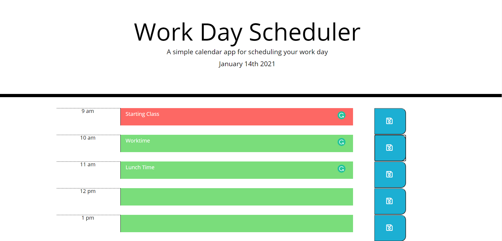

# 05- Day Planner

## Table of Contents

* [Description](#description)
* [Usage](#usage)
* [Questions](#questions)
* [Screenshots](#screenshots)

## Description 

AS a developer, I wanted to show that I could create a day planner that could hold task items and show when time has elapsed by greying it out and locked out. 

## Usage 

Please click on link below to begin program. It is solely front end code and has no indexeddb or backend storage but just local, so if local storage is cleared you will loose it all.

https://robertsantos-dfw.github.io/05-DayPlanner/

## Questions

* GitHub Repo https://github.com/robertsantos-dfw/05-DayPlanner

You can reach me by emailing me at robertsantos.dfw@gmail.com with any additional questions.

## Screenshots

* Getting Started

---
© 2019 Trilogy Education Services, a 2U, Inc. brand. All Rights Reserved.

